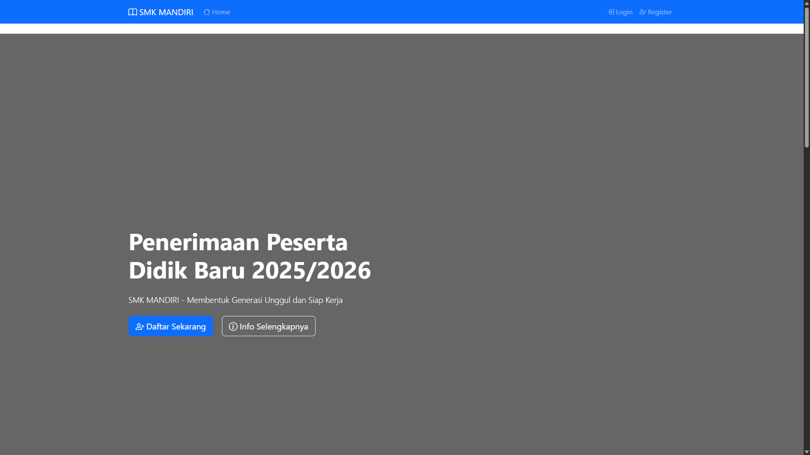
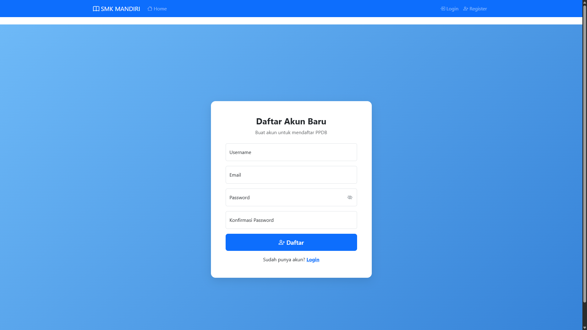
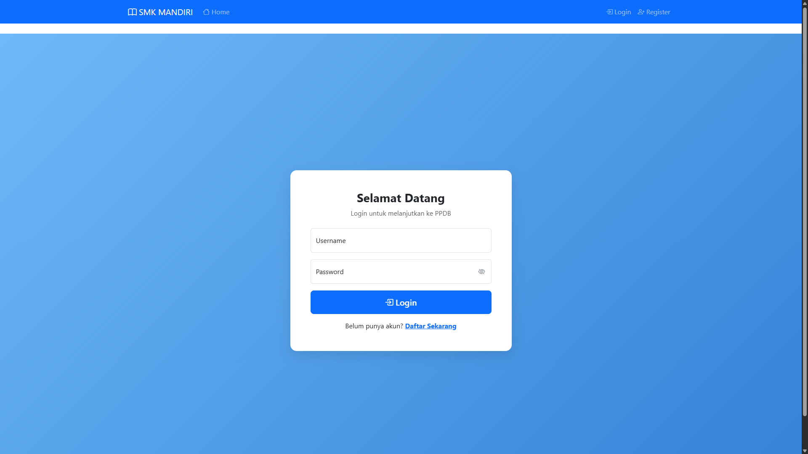
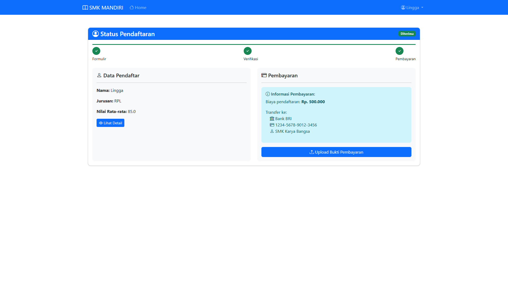
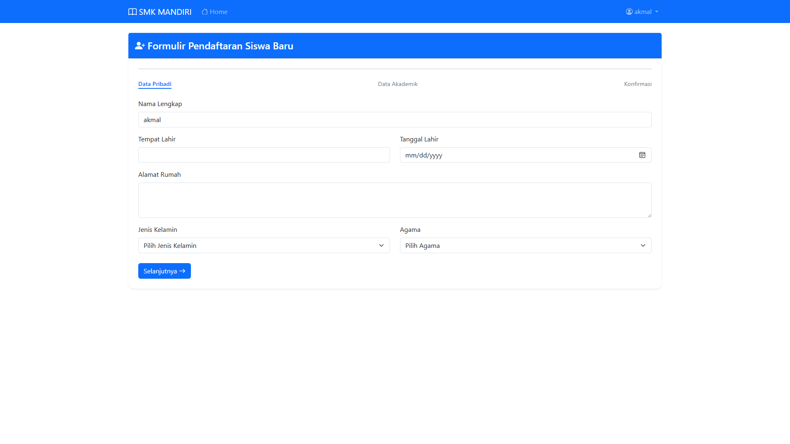
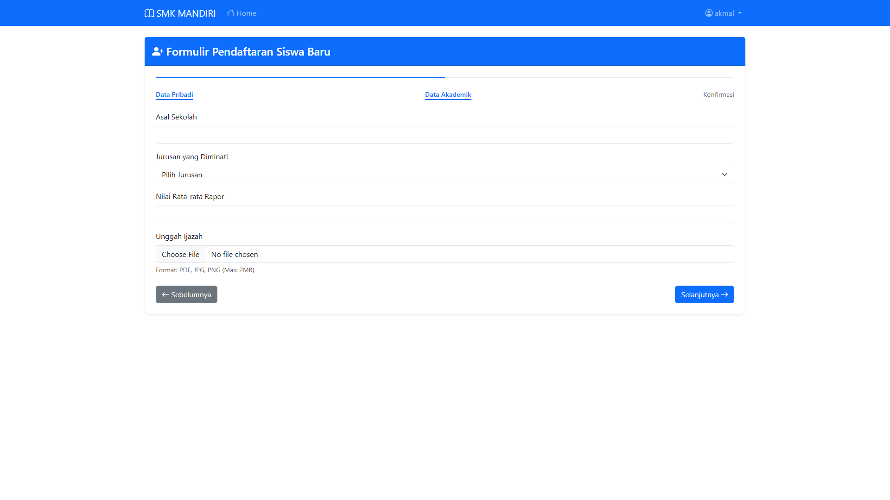
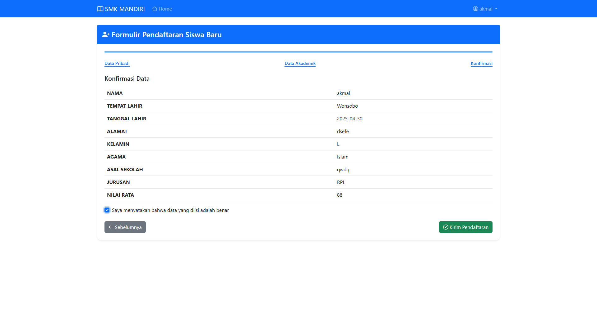
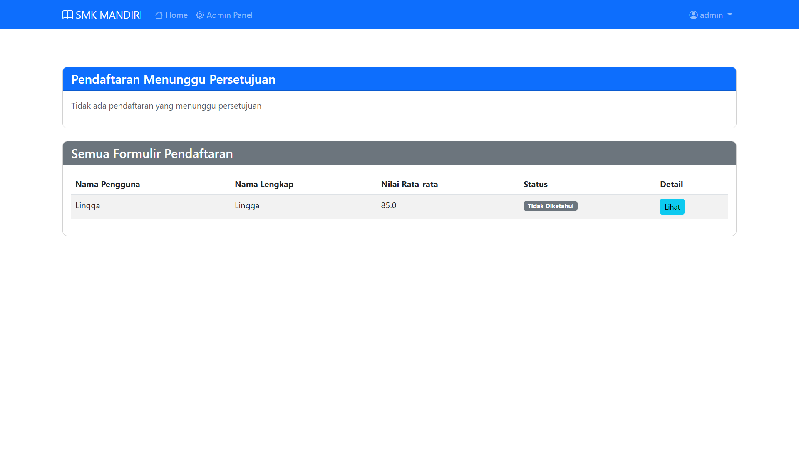
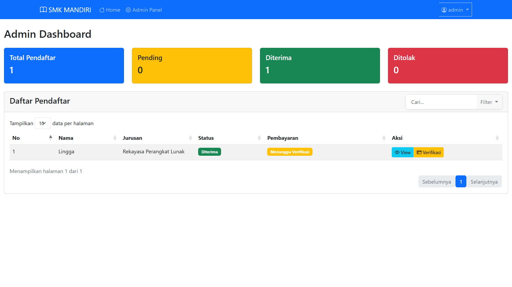

# 📚 PPDB Online System

> A modern web-based application for managing student registrations with role-based access and automated workflows.


---

## 🌟 Overview

PPDB Online System is a student registration management platform with:
- Role-based access control (Admin & Student)
- Real-time application tracking
- Secure document upload & QR verification

### 🏠 Halaman Utama


### 🏠 Keterangan Pendaftaran


### 🏠 Detail Pendaftaran


### 📃 Halaman Register


### 👤 Halaman Login


### 🖊️ Halaman User Dashboard


### 📃🖊️ Halaman Form Data Diri


### 📃🖊️ Halaman Form Akademik


### 📃🖊️ Halaman Form Verifikasi


### ⚙️ Halaman Admin


### ⚙️ Halaman Admin Panel


---

+Note (FOR MAKE ADMIN USER AND PASSWORD)
$env:FLASK_APP = "app.py"
flask shell
admin = User(username='admin')
admin.set_password('admin123')
admin.role = 'admin'
db.session.add(admin)
db.session.commit()
exit()


## 🎯 Features

### 🔐 Authentication & Roles
- Secure login system
- Admin & Student access roles
- Role-based permissions

### 📝 Registration Management
- Clean & responsive registration form
- Progress tracker
- Document upload
- Auto-generated registration number
- QR code for verification

### 👨‍💼 Admin Dashboard
- Overview of registration statistics
- Review applicant details
- Verify documents
- Update application status
- Manage user accounts

### 🎓 Student Portal
- Complete registration forms
- Upload necessary documents
- Track application status
- View/download registration card with QR code

---

## 🛠️ Tech Stack

| Layer        | Tools Used            |
| ------------ | --------------------- |
| Framework    | Flask (Python)        |
| Database     | SQLAlchemy (SQLite)   |
| Frontend     | HTML, CSS, JavaScript |
| Auth         | Flask-Login           |
| File Upload  | Flask-Upload          |
| QR Code      | `qrcode` Python lib   |

---

## ⚙️ Installation

### 🔧 Clone Repository
```bash
git clone <repository-url>
cd ppdb-online
🐍 Set Up Virtual Environment
bash
Salin
Edit
python -m venv .venv
.venv\Scripts\activate  # For Windows
📦 Install Dependencies
bash
Salin
Edit
pip install -r requirements.txt
🛠️ Configure Environment
bash
Salin
Edit
set FLASK_APP=app.py
set FLASK_ENV=development
🧱 Initialize Database
bash
Salin
Edit
flask db init
flask db migrate
flask db upgrade
👤 Create Admin Account
bash
Salin
Edit
flask create-admin
🚀 Run the App
bash
Salin
Edit
flask run
Access via:
🖥️ http://localhost:5000
🔧 Admin: http://localhost:5000/admin

👤 Default Admin Login
Username: admin

Password: admin123

📋 Registration Flow
📝 Register a student account

✍️ Fill in biodata & academic info

📤 Upload required documents

📊 Track your application

💳 Generate your QR registration card

🔒 Security
Password hashing

Role-based access control

Session management

Secure file upload

Form & input validation

📄 Supported Documents
Birth Certificate

School Certificate

Passport Photo

Family Card

Academic Transcripts

🎨 UI/UX Highlights
Responsive & mobile-friendly

Modern interface

Progress indicators

Real-time status notifications

💻 System Requirements
Python 3.8+

Flask 2.0+

Modern Web Browser

Internet connection

Storage for uploaded files

📞 Support
For issues or contributions, please reach out:

📧 Email: support@ppdb.com

💬 Live Chat: Available on website

📝 License
This project is licensed under the MIT License.

markdown
Salin
Edit

---

### 📌 Tips for Usage:
- Ganti `<repository-url>` dengan URL GitHub repo Anda.
- Bila Anda menggunakan `.env` file untuk variabel, ubah bagian `set FLASK_APP=...` jadi `FLASK_APP=app.py` di `.env`.

Jika Anda ingin saya bantu:
- Menghasilkan versi **Markdown file siap pakai**
- Menambahkan **badge CI/CD**, atau
- Membuat versi **README berbahasa Indonesia** juga

Silakan beri tahu!

